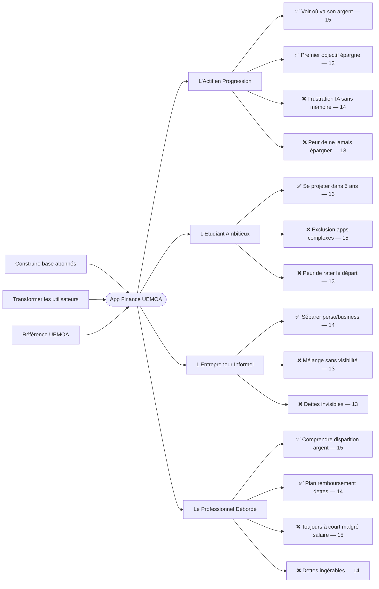

# Trigger Map — [Nom à définir]

**Version :** 1.0
**Date :** 2026-04-03
**Phase :** WDS Phase 2 — Trigger Mapping
**Statut :** Complet

---

## Vue d'ensemble

```
Objectifs Business → [App Finance UEMOA] → Groupes Cibles → Forces Motrices
```

---

## Objectifs Business

### Objectif 1 — Construire une base d'abonnés actifs et rentable
*(Objectif primaire)*

- **1.1** 1 000 abonnés actifs dans les 12 mois suivant le lancement
- **1.2** Churn mensuel inférieur à 5%
- **1.3** Revenu récurrent couvrant les coûts opérationnels à 18 mois

### Objectif 2 — Créer une transformation financière réelle chez les utilisateurs
*(Prérequis — valeur produit)*

- **2.1** 50% des inscrits lancent ≥1 simulation dans les 3 premiers mois
- **2.2** 70% des utilisateurs actifs créent ≥1 objectif financier dans le premier mois
- **2.3** NPS ≥ 50 à 6 mois après lancement

### Objectif 3 — S'imposer comme la référence finance perso en zone UEMOA
*(Prérequis — positionnement long terme)*

- **3.1** 10 000 utilisateurs enregistrés à 24 mois
- **3.2** Taux de référencement de 30% (3 utilisateurs sur 10 invitent un ami)
- **3.3** Partenariat d'intégration avec ≥1 portefeuille mobile à 18 mois

---

## Groupes Cibles

### Groupe 1 — L'Actif en Progression 👥 *(Priorité 1)*

Salarié ou entrepreneur en zone UEMOA, 25-45 ans. Revenus corrects ou modestes. Suit vaguement ses dépenses mais n'a jamais structuré son épargne ni planifié un investissement. Consulte l'IA ou des amis à chaque question financière.

**Lien objectifs :** O1 (volume abonnés), O2 (transformation financière), O3 (référence UEMOA)

#### Forces positives ✅
- **[15]** Voir clairement où va son argent chaque mois — pour ressentir de la maîtrise là où il y avait du flou, dès la première ouverture de l'app
- **[13]** Créer un premier objectif d'épargne concret et réaliste — pour passer du "je devrais épargner" à "voilà mon plan", quand il voit son bilan mensuel
- **[12]** Simuler un investissement (BRVM, immobilier) avec des données réelles — pour transformer une curiosité vague en décision possible

#### Forces négatives ❌
- **[14]** Frustration de tout réexpliquer à l'IA à chaque question sans mémoire ni contexte — inefficacité chronique, à chaque projection
- **[13]** Peur de ne jamais pouvoir épargner avec ses revenus actuels — n'a jamais vu de plan adapté à sa situation concrète
- **[11]** Honte de ne pas comprendre "comment ça marche" malgré son âge — jamais été éduqué en finance

---

### Groupe 2 — L'Étudiant Ambitieux 👤 *(Priorité 2)*

Lycéen ou étudiant en Afrique francophone, 17-25 ans. Premiers revenus (jobs, bourses, aide famille). Jamais éduqué formellement en finance. Veut se projeter avant d'entrer dans la vie active.

**Lien objectifs :** O2 (transformation via éducation), O3 (fidélité dès le départ)

#### Forces positives ✅
- **[13]** Se projeter dans 5 ans avec un plan chiffré et réaliste — pour se sentir en contrôle de sa trajectoire, en pensant à son avenir
- **[13]** Comprendre comment l'argent "fait des petits" — curiosité + ambition, en découvrant les fonctionnalités
- **[13]** Épargner un petit montant régulier pour un objectif précis — prouver que c'est possible même avec peu

#### Forces négatives ❌
- **[15]** Sentiment d'exclusion face aux apps financières complexes — interfaces opaques, jargon technique, dès qu'il essaie un outil
- **[13]** Peur de "rater le départ" financier par ignorance — voit des pairs qui semblent mieux s'en sortir
- **[12]** Paralysie par peur de faire une erreur irréparable avec son premier argent — manque total de guidance

---

### Groupe 3 — L'Entrepreneur Informel 👤 *(Priorité 3)*

Gérant d'une petite activité (commerce, artisanat, services) en zone UEMOA. Mélange finances perso et business. Aucun outil adapté à sa réalité. Cherche à structurer sans se perdre.

**Lien objectifs :** O1 (segment prêt à payer), O2 (transformation concrète)

#### Forces positives ✅
- **[14]** Séparer clairement finances perso et finances business — pour savoir si l'activité est réellement rentable, en fin de mois
- **[12]** Anticiper les creux de trésorerie avec un plan simple — éviter les mauvaises surprises
- **[11]** Visualiser si l'activité lui permet d'épargner — lien concret entre business et avenir personnel

#### Forces négatives ❌
- **[13]** Frustration de mélanger perso et business sans jamais savoir où il en est — pas d'outil adapté à sa réalité
- **[13]** Peur d'accumuler des dettes sans s'en rendre compte — pas de suivi systématique
- **[12]** Peur que l'activité ne génère pas assez pour vivre et épargner — aucune visibilité sur les flux réels

---

### Groupe 4 — Le Professionnel Débordé 👤 *(Priorité 2 ex-aequo)*

Cadre, ingénieur, médecin, enseignant supérieur en zone UEMOA. Revenus confortables mais dispersés — crédits, obligations familiales, dépenses impulsives. Sait qu'il gagne bien, ne comprend pas pourquoi il ne s'en sort pas.

**Lien objectifs :** O1 (fort potentiel d'abonnement payant), O2 (reprise de contrôle), O3 (bouche-à-oreille professionnel)

#### Forces positives ✅
- **[15]** Comprendre exactement pourquoi son argent "disparaît" malgré un bon salaire — mettre fin au mystère, en faisant son point mensuel
- **[14]** Établir un plan de remboursement des dettes structuré et atteignable — retrouver de la sérénité
- **[14]** Reprendre le contrôle et se fixer un premier objectif d'épargne — fierté et autonomie retrouvées

#### Forces négatives ❌
- **[15]** Frustration d'être toujours "à court" en fin de mois malgré son salaire — dépenses non suivies, obligations familiales non planifiées
- **[14]** Peur que ses dettes soient ingérables — n'a jamais cartographié l'ensemble de ses engagements
- **[13]** Honte de sa situation malgré son niveau d'études et de revenus — dissonance identitaire profonde

---

## Priorisation — Feature Impact Analysis

### Forces HAUTE PRIORITÉ (14-15) → MVP obligatoire

| Force | Groupe | Score |
|-------|--------|-------|
| Voir clairement où va son argent | G1 | 15 |
| Frustration d'être toujours à court en fin de mois | G4 | 15 |
| Comprendre pourquoi l'argent "disparaît" | G4 | 15 |
| Sentiment d'exclusion face aux apps complexes | G2 | 15 |
| Frustration de tout réexpliquer à l'IA sans mémoire | G1 | 14 |
| Séparer finances perso et business | G3 | 14 |
| Plan de remboursement des dettes structuré | G4 | 14 |
| Reprendre le contrôle + premier objectif épargne | G4 | 14 |
| Peur que les dettes soient ingérables | G4 | 14 |

### Forces MOYENNE PRIORITÉ (11-13) → Phase 2

| Force | Groupe | Score |
|-------|--------|-------|
| Créer un premier objectif d'épargne | G1 | 13 |
| Peur de ne jamais pouvoir épargner | G1 | 13 |
| Se projeter dans 5 ans avec un plan | G2 | 13 |
| Peur de rater le départ financier | G2 | 13 |
| Honte de sa situation malgré ses revenus | G4 | 13 |
| Frustration mélange perso/business | G3 | 13 |
| Peur d'accumuler des dettes sans s'en rendre compte | G3 | 13 |
| Simuler un investissement BRVM/immobilier | G1 | 12 |
| Anticiper les creux de trésorerie | G3 | 12 |
| Paralysie par peur de l'erreur financière | G2 | 12 |
| Honte de ne pas comprendre la finance | G1 | 11 |
| Visualiser si l'activité permet d'épargner | G3 | 11 |

---

## Implications MVP

### 3 piliers non-négociables

**Pilier 1 — Tableau de bord santé financière**
Visibilité immédiate sur où va l'argent. Répond aux forces 15/15 de G1 et G4.

**Pilier 2 — Gestion et plan de remboursement des dettes**
Cartographie des dettes + chemin de sortie structuré. Répond aux forces critiques de G4 et G3.

**Pilier 3 — IA contextuelle avec mémoire**
Fini de tout réexpliquer. L'app connaît la situation de l'utilisateur et propose. Différenciateur central.

### Ce qui attend la Phase 2
- Moteur de simulation BRVM / investissements
- Anticipation de trésorerie (entrepreneur)
- Projection long terme (étudiant)

---

## Diagramme Mermaid



---

**Prochaine phase :** WDS Phase 3 — UX Scenarios
